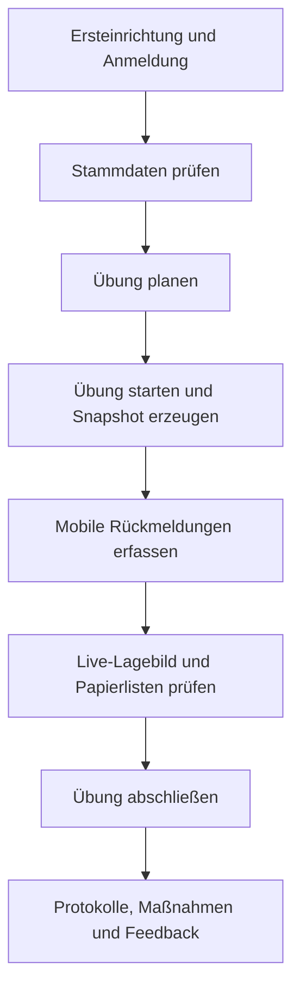

# Architekturübersicht

## Zielbild

Die Anwendung wird als modularer Schulserver-Dienst aufgebaut. Sprint 1 nutzt bewusst einen dependency-armen Node.js-HTTP-Server mit statischer PWA, damit Start, Tests und Docker ohne Paketinstallation funktionieren. Die fachlichen Module sind so zugeschnitten, dass sie später in eine Express/Fastify-API, Prisma/PostgreSQL und React-Komponenten überführt werden können.

## Laufzeitbausteine

1. **PWA-Client (`apps/web/public`)**
   - Browseroberfläche mit geführtem Ablauf, Hauptnavigation und Offline-Warteschlange.
   - Service Worker für Cache und eingeschränkten Offlinebetrieb.
   - Sendet CSRF-Token bei schreibenden API-Aufrufen.
2. **API-Server (`apps/api/src/server.js`)**
   - HTTP-Routing, Security Header, Session-Cookie, CSRF-Prüfung und Berechtigungsprüfung.
   - Liefert statische Assets und REST-Endpunkte aus einem Prozess.
3. **Domänenlogik (`apps/api/src/data.js`)**
   - In-Memory-Store, optionale JSON-Persistenz, Rollen, Stammdaten, Übungen, Snapshots, Formulare, Maßnahmen und Audit.
4. **Ablaufsteuerung (`apps/api/src/workflow.js`)**
   - Berechnet aus dem Domänenzustand den nächsten sinnvollen Arbeitsschritt.
   - Entkoppelt Benutzerführung von einzelnen UI-Karten.
5. **Projektmanagement (`docs/project-management`, `scripts`)**
   - Backlog, Kanban, Roadmap und GitHub-Project-Synchronisation.

## Fachlicher Ablauf

## Schnittstellenprinzipien

- Schreibende Endpunkte sind rollen- und CSRF-geschützt.
- Der Bootstrap liefert keine sensiblen Unterstützungsbedarfe an ungezielte Stammdatenlisten.
- Infoportal-Integration bleibt Provider-basiert; undokumentierte Endpunkte werden nicht erfunden.
- Der Workflow-Endpunkt ist rein lesend und kann gefahrlos für UI-Führung genutzt werden.

## Nächste Architekturhärtung

- Persistenzschicht abstrahieren und PostgreSQL/Prisma ergänzen.
- Passwort-Hashing auf Argon2id umstellen, sobald Abhängigkeiten eingeführt werden.
- API-Router in fachliche Module aufteilen.
- Komponentenbasierte React-/TypeScript-PWA einführen.
