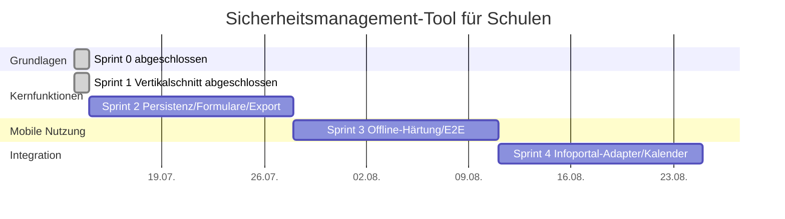

# Roadmap

## Kompakte Epic-Roadmap
- Fundament: Sprint 0 abgeschlossen.
- Alarmübung und Anwesenheit: Sprint 1 abgeschlossen.
- Formulare, PDF, Maßnahmen: Sprint 2 geplant.
- Offline-Härtung und E2E: Sprint 3 geplant.
- Portal-/Kalenderintegration: Sprint 4 geplant.
