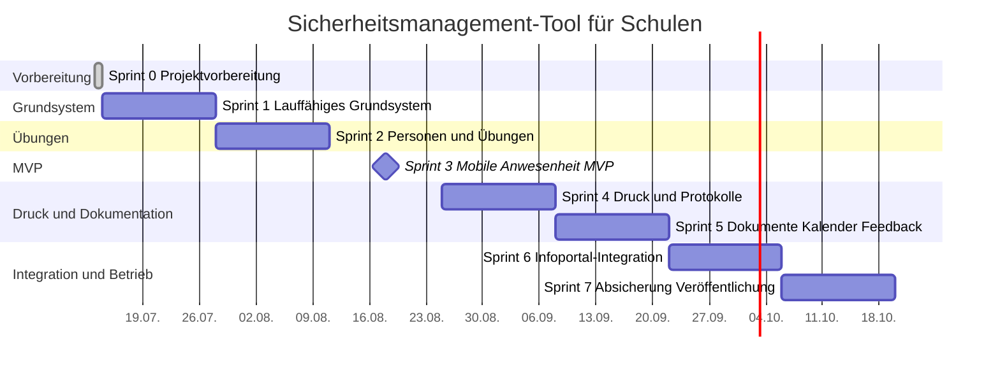

# Roadmap

## Roadmap nach Epics

1. Grundsystem und Benutzerverwaltung: Sprint 1.
2. Schulverwaltung: Sprint 1 bis Sprint 2.
3. Übungen: Sprint 2.
4. Mobile Anwesenheitserfassung: Sprint 3, MVP-Meilenstein.
5. Listen und Ausdrucke: Sprint 4.
6. Protokolle: Sprint 4.
7. Informationen und Dokumente: Sprint 5.
8. Feedback und Umfragen: Sprint 5.
9. Schulkalender: Sprint 5.
10. Schule-Infoportal: Sprint 6.
11. Datenschutz und Betrieb: Sprint 7.
